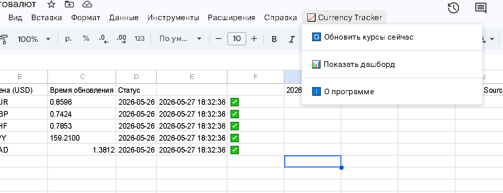
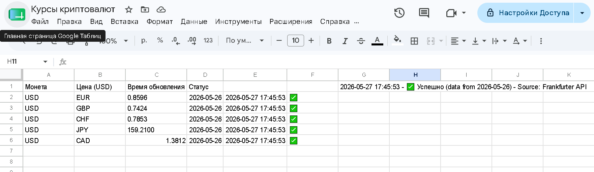
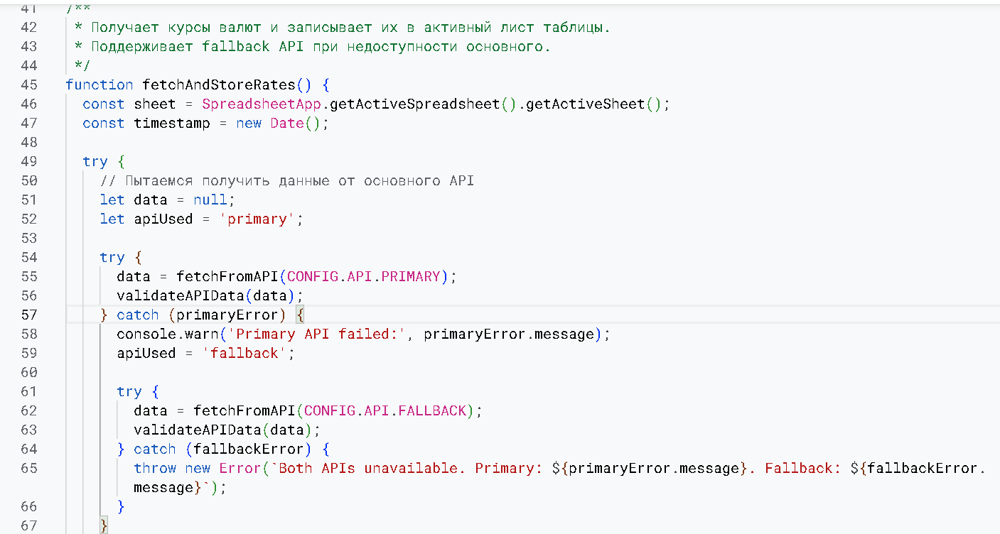

# 💱 Currency Rates Tracker for Google Sheets

Автоматический трекер курсов валют в Google Таблицах с использованием публичного API Европейского Центробанка.

## ✨ Возможности

- 📊 Получение актуальных курсов валют (USD → EUR, GBP, CHF, JPY, CAD)
- 🔄 Автоматическое обновление по расписанию (каждый час)
- 🖱️ Ручное обновление через пользовательское меню
- 🛡️ Автоматический fallback на резервный API при недоступности основного
- 📈 Простой дашборд с последними курсами
- 📤 Экспорт данных в Google Doc
- ⚠️ Расширенная обработка ошибок с логированием

## 🚀 Быстрый старт

### 1. Создай новую Google Таблицу
[sheets.new](https://sheets.new)

### 2. Открой редактор скриптов
`Расширения` → `Apps Script`

### 3. Вставь код
Скопируй содержимое `CurrencyRates.gs` в редактор

### 4. Сохрани и запусти
`Ctrl + S` → выбери функцию `fetchAndStoreRates` → нажми ▶️

### 5. Обнови таблицу
Вернись в таблицу и обнови страницу (`F5`)

### 6. Используй меню
Найди меню `📈 Currency Tracker` в шапке таблицы

## 📋 Результат в таблице

| Base | Target | Rate | API Date | Updated At (Local) | Status |
|------|--------|------|----------|-------------------|--------|
| USD | EUR | 0.8596 | 2026-05-26 | 2026-05-27 17:45:53 | ✅ |
| USD | GBP | 0.7424 | 2026-05-26 | 2026-05-27 17:45:53 | ✅ |
| USD | CHF | 0.7853 | 2026-05-26 | 2026-05-27 17:45:53 | ✅ |
| USD | JPY | 159.2100 | 2026-05-26 | 2026-05-27 17:45:53 | ✅ |
| USD | CAD | 1.3812 | 2026-05-26 | 2026-05-27 17:45:53 | ✅ |

## ⚙️ Настройка автоматического обновления

В редакторе скриптов:
1. Выбери функцию `setupHourlyTrigger`
2. Нажми ▶️ Запуск
3. Разреши необходимые доступы

## 🛠️ Технические детали

### API
- **Primary:** [Frankfurter API](https://www.frankfurter.app/) (European Central Bank)
- **Fallback:** [ExchangeRate.host](https://exchangerate.host)

### Лимиты
- Frankfurter: до 1000 запросов в час
- ExchangeRate.host: до 1500 запросов в месяц (бесплатный тариф)

## 📸 Скриншоты

| Меню в таблице | Результат работы | Код скрипта |
|----------------|------------------|-------------|
|  |  |  |

## 📄 Лицензия

MIT

---

⭐ Если проект полезен, поставь звезду на GitHub!
